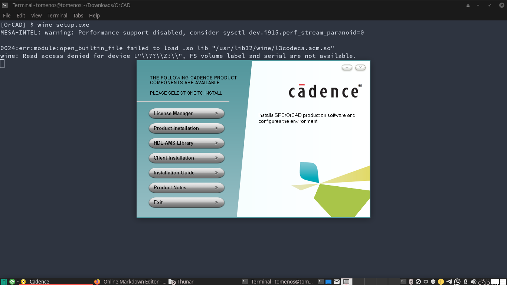
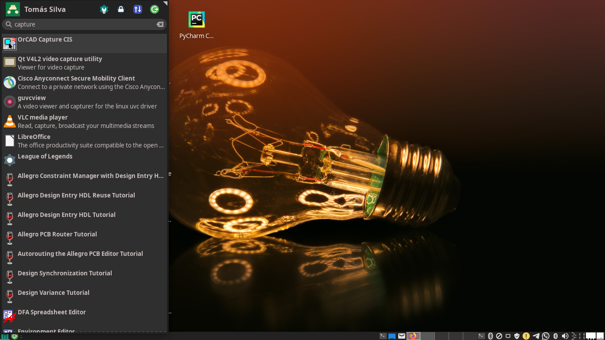
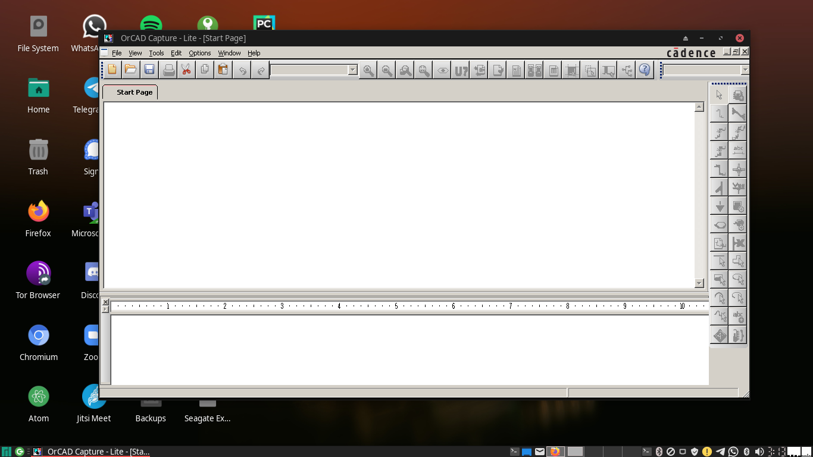

# Running LT Spice on linux trough wine
# (by Tomás S. R. Silva)

## Installing Wine and other dependencies
[WINE](https://www.winehq.org/) (originally an acronym for "Wine Is Not an Emulator") is a compatibility layer capable of running Windows applications on several POSIX-compliant operating systems, such as Linux, macOS, & BSD.

For Arch Linux, you can install the latest stable version of Wine and useful dependencies by entering the following command:

```
$ sudo pacman -Syu
$ sudo pacman -S wine winetricks wine-mono wine_gecko
```

For Ubuntu, an equivalent is
```
$ sudo apt-get update
$ sudo apt-get install wine wine-mono wine-gecko winetricks
```
### Wine configuration

A lot of programs will only work if we configure a new 32 bit "Wine prefix." To configure Wine, proceed as follows:

1. Open Winetricks from the application launcher to get started (or run ``` $ winetricks &```)

2. Select "create new wineprefix" and click OK.

3. Choose 32 bit for architecture and fill in whatever name you like, and then click OK.


## Installing LT Spice

1. Download the Lite Spice (aka Orcad) 16.5 at [THIS LINK](https://brpucrs-my.sharepoint.com/:u:/g/personal/arthur_santos89_edu_pucrs_br/EWHYK5HXv1xOnQY73d6W9KoBVX_9CrxJgiyekcU9RlFxmg?e=NcSgFb).

2. Download the .iso file and navigate to the directory that you downloaded it (e.g. ~/Downloads)
   
3. Proceed with the following commands:
   
```
$ cd Downloads
$ mkdir mnt
$ sudo mount -o loop OrCAD.iso /mnt
$ cd mnt
$ wine setup.exe
```

4. The previous commands will start the installing sequence for LT Spice. Just click on Product Installation and follow the instructions.


5. Search for 'Capture CIS' on your program manager.


6. Have fun!

