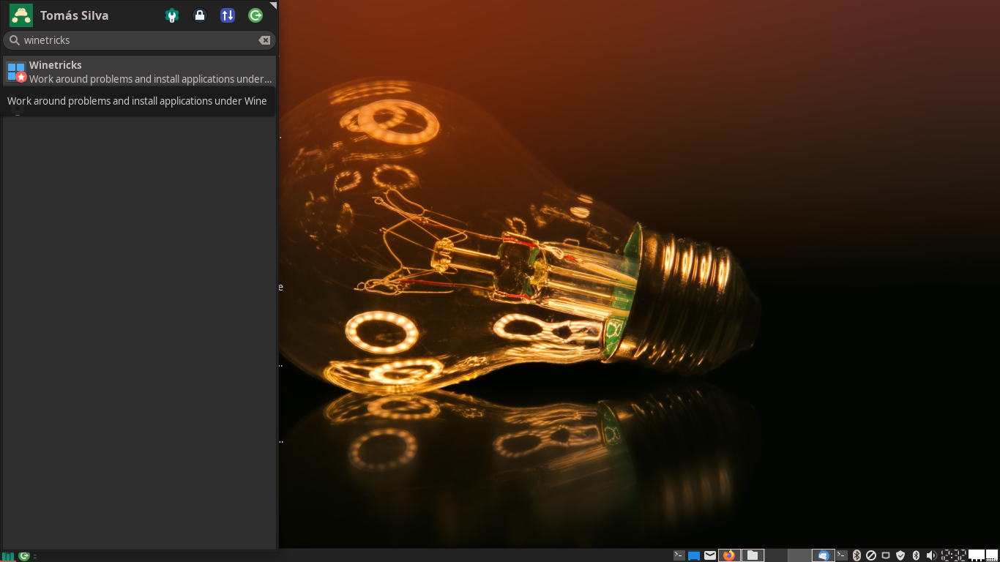
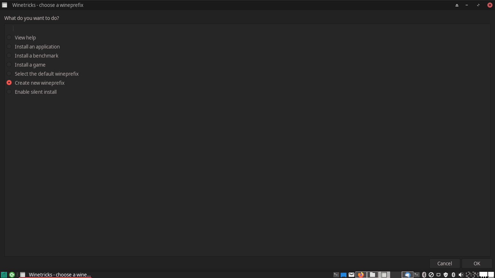
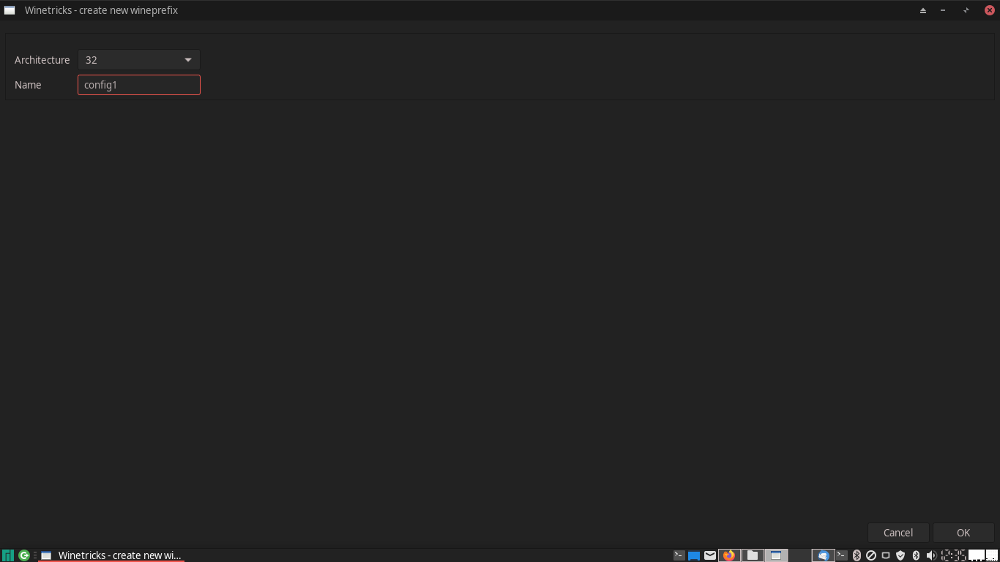

# Running LT Spice on linux trough wine
# (by Tomás S. R. Silva)

## Installing Wine and other dependencies
[WINE](https://www.winehq.org/) (originally an acronym for "Wine Is Not an Emulator") is a compatibility layer capable of running Windows applications on several POSIX-compliant operating systems, such as Linux, macOS, & BSD. 

For Arch Linux, you can install the latest stable version of Wine and useful dependencies by entering the following command:

```
$ sudo pacman -Syu
$ sudo pacman -S wine winetricks wine-mono wine_gecko
```

For Ubuntu, an equivalent is
```
$ sudo apt-get update
$ sudo apt-get install wine wine-mono wine-gecko winetricks
```
### Wine configuration

A lot of programs will only work if we configure a new 32 bit "Wine prefix." To configure Wine, proceed as follows:
1. Open Winetricks from the application launcher to get started (or run ``` $ winetricks &```)

2. Select "create new wineprefix" and click OK.

3. Choose 32 bit for architecture and fill in whatever name you like, and then click OK. 



## Installing LT Spice
1. Fill the form, request and download the Lite Spice (aka Orcad) at [THIS LINK](https://www.orcad.com/orcad-academic-program).
2. 